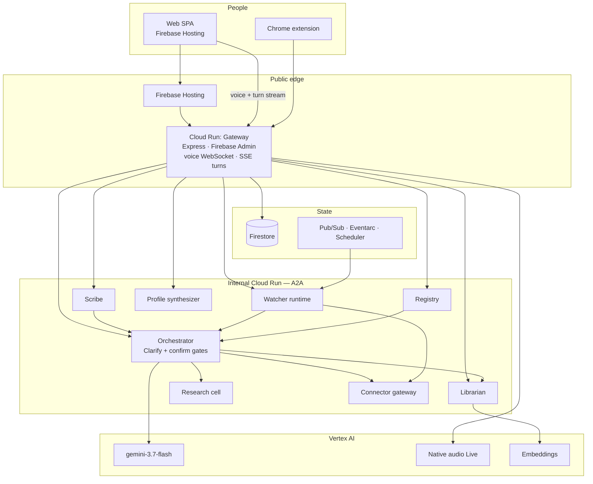

# AllTheWay

A companion you talk to, that watches and acts for you, and that learns how you
think — with everything it does visible enough to audit.

Live: [alltheway.rinegansolutions.com](https://alltheway.rinegansolutions.com)

It keeps working when you are not looking at it. Ambiguous requests stop and
ask. Irreversible steps stop and wait for a yes. Documents are answered with
citations you can open. Meetings it joins cannot speak — a property of how it
is built, not a setting.

Work started **22 August 2026**.

## Architecture

Nine Cloud Run services in one GCP project. The gateway is the only process on
the public internet. Internal calls are A2A with Google-signed identity tokens.
Firestore is path-scoped per user; a build guard fails if a collection-group
query appears.



The gateway verifies the Firebase ID token, retrieves passages as that user,
and drives the orchestrator. The browser never talks to an agent, and never
supplies a uid for retrieval.

## Repository

```
├── web/                      React SPA. Marketing at /, the product at /app.
├── extension/                Manifest V3 capture when a hosted meeting is not an option.
├── services/
│   ├── contracts/            zod schemas shared by web and gateway.
│   ├── gateway/              Express + firebase-admin. The only public service.
│   ├── orchestrator/         Clarify Gate, confirm gate, plan graph.
│   ├── librarian/            Documents in, path-scoped passages out.
│   ├── scribe/               Meetings. Listens; cannot speak.
│   ├── research-cell/        Bounded research fan-out.
│   ├── connector-gateway/    The only path to a connector.
│   ├── watcher-runtime/      Standing instructions. Owns the autonomy floor.
│   ├── profile-synthesizer/  Corrections become learned preferences.
│   └── registry/             Signed AgentCards, verified when you open Agents.
├── libs/                     Policy, screening, agent auth, cards, metering.
├── infra/                    Terraform. One project, dev and prod workspaces.
├── scripts/                  Build guards — tenant isolation, locales, tests listed.
└── docs/                     Product, architecture, implementation plans.
```

`contracts` lives under `services/` because the services define the wire format;
`web` consumes it. Renaming a field on one side fails the build on the other.

## Prerequisites

- **Node.js** 22 or newer
- **Python** 3.11 or newer
- **JDK** — the Firestore, Auth, and Pub/Sub emulators are Java processes
- **npm** (workspaces)

Vertex is always the real API. There is no model emulator. Local runs use a
deterministic fake provider unless `USE_VERTEX=true` and a GCP project are set.

## Running locally

```bash
cp .env.example .env.local   # then source it, or export the vars in your shell
npm install

npm run dev:emulators        # Firestore :8081, Auth :9099, Pub/Sub
npm run seed                 # once, against the emulator
npm run dev:gateway          # :8080
npm run dev:orchestrator     # :8090
npm run dev:watchers         # :8091
npm run dev:synth            # :8092
npm run dev:research         # :8093
npm run dev:connectors       # :8094
npm run dev:web              # :5173, proxies /api (and the voice socket) to the gateway
```

`ALLOW_ANONYMOUS=true` serves a fixed local identity. It refuses to engage when
`NODE_ENV=production`.

`GET http://localhost:8080/healthz` should return `{"ok":true}`.

Production is Terraform (`infra/`) and Cloud Build on `main`. See
[`infra/README.md`](infra/README.md).

## Reproducible testing

You do not need to run this repo. Open the hosted product and sign in.

1. Go to [https://alltheway.rinegansolutions.com](https://alltheway.rinegansolutions.com)
2. Sign in with the test account:
   - **Email:** `alltheway@rinegansolutions.com`
   - **Password:** in the Devpost submission (judges and managers only — it is not in this README)
3. You land on Today. From there you can talk to the companion, add a document and ask about it, open Watchers, or enable meetings.

That is the same production stack the architecture diagram describes. A cold start on Cloud Run can take a few seconds on the first request.

## Unit tests (contributors)

CI runs these before an image ships. They are not required to try the product.

```bash
npm run guards
npm run typecheck
npm --workspace @alltheway/contracts test
npm --workspace @alltheway/gateway test
npm --workspace @alltheway/scribe test
npm run test:py
( cd services/librarian && python -m pytest tests -q )
( cd services/registry && python -m pytest tests -q )
```

`npm run guards` is the tenant-isolation, locale, plan-table, image-deps, and
tests-listed checks. Gateway tests want the Firestore emulator
(`npm run dev:emulators`). Web typecheck is `tsc -b`, not `tsc -p`.

## Where the important rules live

| Rule | File |
|---|---|
| Product (PRD) | `docs/AllTheWay-PRD.md` |
| Requirements (high- and low-level) | `docs/AllTheWay-Requirements.md` |
| Irreversible actions always stop for review | `libs/policy` and `services/orchestrator/app/graph.py` |
| Ambiguous requests never get acted on | `services/orchestrator/app/graph.py` |
| A citation must be a retrieved passage | `services/orchestrator/app/grounding.py` |
| Every request is authorised server-side | `services/gateway/src/auth.ts` |
| One definition of every wire type | `services/contracts/src/index.ts` |
| Design tokens, one value per axis | `web/src/globals.css` |

Each of those has tests that fail if the rule is broken.
