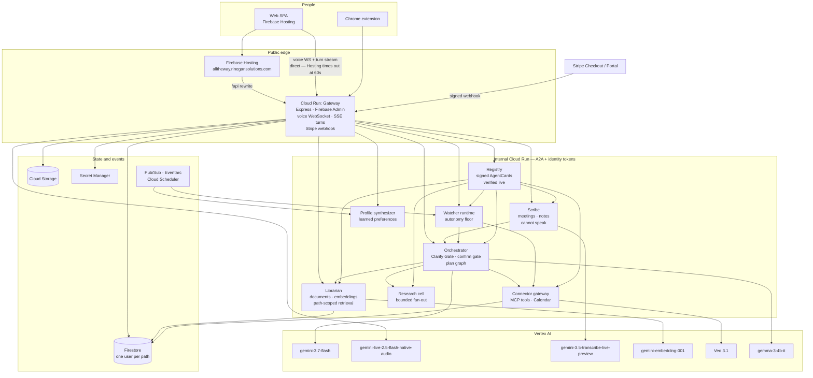

# AllTheWay — Devpost submission draft

> Draft. Remaining fields that need you before submitting are marked **[NEEDS YOU]**: sharing a private repo, the test-account password (Devpost field only), and publishing the bonus content / social post. Start date, testing instructions, and the architecture diagram are filled in from the repo.

---

## Inspiration

I kept noticing the same gap in every AI assistant I used. They were good at answering and useless at *following through*. You'd have a long, useful conversation, close the tab, and none of it had any consequence. Nothing was watching. Nothing remembered that you'd corrected it about the same thing three times. The next session started from zero, and you started over with it.

The other thing that bothered me was how little you could see. You'd ask for something, a paragraph would appear, and you had no idea what it read, which tool it called, or whether it had quietly done something on your behalf. When people say they don't trust these systems, I don't think they mean the model is wrong too often. I think they mean they can't check.

So AllTheWay started from two commitments. It should keep working when you're not looking at it. And everything it does should be visible enough to audit — not a summary of what it did, but the actual trace.

## What it does

AllTheWay is a companion you talk to, that watches and acts for you, and that learns how you think from your corrections.

**Today:** Open the app and you get the next twelve hours: what is on the calendar, when to leave for it, and what is still waiting on you. Connect Calendar, Gmail, and Drive from that screen. It will not quietly rearrange your day.

**Talk, typed or spoken:** Same companion, same memory. Voice follows the language you are using, including halfway through a sentence. Plenty of people speak English and Yorùbá in the same breath. If the companion "tidies" that into one language, it is correcting them.

**It shows the plan first:** If something cannot be undone, you see it, you can edit it, and it waits. Yes puts the event on the calendar or saves the Gmail draft. No does nothing. "Not quite" is the learning path: you say what it should have been, and that is stored. It does not send mail because the model sounded sure.

**Work chats, and things you can keep:** You describe the job. It writes a document, a sheet, a deck, an image, or a short clip. "No, shorter, and drop the second paragraph" becomes the reason on the next version. Those files sit beside the thread, not in a separate tool you have to go find.

**Documents you can ask about:** Add a contract or a spec. Answers come with citations you can click. Delete the file and what it learned from it goes too.

**Watchers:** Watchers track your connectors and reminds you of upcoming activities so you don't miss anything important. Create a new watcher and tell it what you want monitoredu.

**Meetings:** It joins, listens, and takes notes. It cannot speak; that is how it is built, not a setting you might forget. Everyone is asked before it connects. If live listen is not available, it uses the transcript afterwards, or a browser extension that captures on your machine. Action items from a call stay as proposals until you confirm them.

**Your Profile:** Preferences it has learned sit on a page you can read, with evidence. Revert stamps the old belief rather than deleting it, so you can still see what it used to think.

**The interface in seven languages:** English, French, Spanish, Portuguese, Chinese, Yorùbá, and Welsh. Voice covers 85+ and switches when you do.

**You can check who is allowed to act:** Each specialist publishes a signed capability card. The Agents page verifies that signature when you open it, not only when the app was deployed. A capability that stops verifying says so.

## How we built it

Nine services on Cloud Run, one GCP project, everything in Terraform with dev and prod as workspaces.

The gateway is the only service reachable from the internet. Express with `firebase-admin`, and it holds the voice WebSocket — deliberately, because it's the only process that can observe how long a session actually lasted, so it's the only place usage can be metered without trusting the client to report its own consumption.

Behind it the orchestrator runs the planning graph: the Clarify Gate that stops a turn when the request is ambiguous instead of guessing, and the confirm gate that refuses to run a plan with an irreversible step until you say yes. Around it sit the librarian (documents and retrieval), the scribe (meetings), the research cell, the connector gateway, the registry, the watcher runtime, and the profile synthesiser that turns corrections into learned preferences.

Services talk over A2A with signed AgentCards — ES256 detached JWS over canonically-serialised JSON, with the `signatures` field excluded from what's signed. The Python side publishes and the TypeScript side signs; we proved the interop by having the Python library verify a card the TypeScript signer produced.

Firestore holds everything, path-scoped per user. No collection-group queries anywhere, and a check fails the build if one appears — cross-tenant retrieval is the one failure this product cannot have.

Untrusted content is screened before any model reads it, and the screener fails closed. We tested it the only way that means anything: fed it a prompt injection, confirmed it was transcribed rather than obeyed, then confirmed the screener blocked it.

Billing is Stripe, with the tier on the Subscription metadata, a refetch rather than trust in the webhook body, signature verification, and idempotency keyed on `event.id` so a replayed event writes once.

Five checks run before anything ships: tenant isolation, image dependencies, the plan table matching what's enforced, locale completeness, and whether every test file is genuinely being executed.

## Challenges we ran into

**The bugs that passed every check.** This is the theme of the project. Nearly every serious failure compiled cleanly and had green tests.

The worst was an ingress misconfiguration. Every backend service was `INGRESS_TRAFFIC_INTERNAL_ONLY`, which reads as the strict, correct choice — but there was no VPC anywhere in the Terraform, and a Cloud Run service calling another leaves over the public internet unless its egress routes through a VPC. Cloud Run rejects those with a **404, not a 403**, so the gateway turned it into a 502. The agents page had returned 502 for thirty days and had *never once succeeded*. We found it by reading production request logs and noticing that every endpoint the gateway served itself returned 200 while every endpoint it proxied failed.

Fixing that revealed a second fault underneath. `google-auth` does not install `requests`, and `google.auth.transport.requests` raises `ImportError` without it. That import sat inside a broad `except`, logged at `debug` — which is also exactly what a developer laptop with no metadata server looks like. Every internal call had been going out with no `Authorization` header at all, invisibly, for weeks. Two stacked faults, and the first was masking the second.

**A test suite that certified a bug.** The morning digest read `status == "awaiting_confirmation"` while the watcher runtime wrote `state: "awaiting_review"`. No document has ever carried that field and value, so the "needs your decision" list was permanently empty however many runs were genuinely waiting. It survived because every test fixture had been written to match the *reader* instead of the *writer*. A green suite proved nothing. We rewrote the fixtures to the runtime's shape and verified the fix by reverting the reader and watching three tests fail.

**Typechecking that wasn't.** `web`'s tsconfig is solution-style with `"files": []`, so `tsc -p` checks nothing and exits 0. There was no `typecheck` script at all, and CI ran lint and build — but Vite builds with esbuild, which strips types without reading them. Type errors had been reaching production as runtime failures the entire time.

**A white screen where the sign-in form should be.** `useT` throws when it finds no provider — deliberately, so a missing catalogue surfaces instead of rendering raw keys. That makes the provider boundary load-bearing, and when it wrapped only the authenticated area, every auth screen threw on render. Nothing failed to compile and no test noticed. There is now a build check on the shape of that tree.

**Latency that was entirely cold starts.** Users reported the app was slow to open. The bundle was fine — 112KB over the wire. The request logs showed a p50 of 0.06s against a p95 of 4–10s on *every* endpoint, and nothing genuinely slow is fast half the time. Instances were finishing startup five seconds after the request that woke them.

**Guards that couldn't fail.** We wrote a dependency check that could never trip, because the pattern it looked for was matched by an unrelated `COPY` line. And a `terraform validate` that passed vacuously because it ran in a directory holding only tfvars. Both looked green for weeks. The rule that came out of it: after writing a guard, break the thing on purpose and watch it fail, or you haven't written a guard.

**Terraform's `merge()` is shallow.** A service listed in two maps lost the keys from the first, which took secret-access IAM down to three of five services and caused a short production incident. Later, a service missing from the roles map entirely had no Firestore permission at all — its container crashed on every request and restarted clean, so the logs showed healthy startups and nothing else.

## Accomplishments that we're proud of

**Tenant isolation that's structurally enforced, not merely intended.** No collection-group queries, no user-owned root collections, and a guard that fails the build if either appears. "Cross-user retrieval is unacceptable" is a sentence many projects put in a README. Here it's a check that runs before every deploy.

**The autonomy floor.** Tests were written before the mechanism, and it's still the strongest code in the repo. A watcher cannot take an irreversible action regardless of how its ceiling is configured.

**Meeting insights that cost what they should.** The backing-off schedule holds a ninety-minute meeting to ten reasoning passes instead of ninety, without the user having to think about it.

**Signed capability contracts, verified live.** The Agents page checks each signature when you open it, so a capability that silently stops verifying is visible immediately rather than at the next deploy.

**Seven languages, wired end to end.** 234 keys, each locale its own ~8KB chunk, so a French user never downloads Yorùbá and an English user downloads neither. Plural categories come from `Intl.PluralRules`. Welsh has six categories and drives consonant mutation — *peth* becomes *beth* becomes *pheth* — and it is driven correctly by the plural category. A `count === 1` check would read as illiteracy to a native speaker.

**Voice that follows the speaker.** No language code is sent, and a test asserts that field stays absent — because pinning one would lock the session to a single language and quietly undo the whole behaviour.

**584 tests** — 211 TypeScript, 373 Python — and five build guards, each of which we have deliberately broken to confirm it fails.

## What we learned

**A green build is evidence of very little.** The single most valuable habit we developed was reproducing the failure, fixing it, then reproducing the fix. Every significant bug in this codebase typechecked, and one of them was actively certified by its own tests.

**Test the writer, not the reader.** The digest bug survived because its fixtures were written to match the code under test rather than the code that produces the data. A fixture that agrees with the reader tests nothing at all.

**Silent failure paths are worse than loud broken ones.** The missing `requests` package cost weeks precisely because it was handled gracefully. A broad `except` that logs at `debug` turns a packaging bug into an invisible one. We now separate the two cases explicitly: a metadata server that won't answer is normal on a laptop and stays at debug; a build that *cannot* mint tokens at all is an error that names the fix.

**404 doesn't always mean "not found".** Cloud Run uses it for ingress rejection, which sends you hunting for a routing bug when the problem is network policy.

**Read the logs before forming a theory.** The breakdown of which paths returned 200 and which returned 502 identified a month-old outage in about a minute, after a good deal of speculation had gone nowhere.

**Write the interface for the person who has to trust it.** The most valuable design decisions weren't technical — the confirm gate, the append-only ledger, the live signature check. Those are what make the thing checkable, and checkable is what trust actually rests on.

## What's next for AllTheWay

- **Close the acting gap.** Confirming a plan currently writes a ledger row; it does not yet put the event on your calendar. The architecture for it is designed — the gateway calls the connector gateway over A2A with the stored arguments — and it is the single change that turns "here is a plan" into "it is done".
- **Native review of the six machine-drafted catalogues.** The interface is wired and switching works, but only English has been read by someone who speaks it. Machine translation is a first pass, not a release.
- **Real observability on the turn path.** The orchestrator logs startup and shutdown and little else, so a failed turn leaves no trace. It should have been first.
- **Publish the browser extension** once the store listing is done.
- **Google Meet Developer Preview** integration, deferred to v4.

---

## Built with

`google-cloud` · `cloud-run` · `firestore` · `firebase` · `firebase-auth` · `firebase-hosting` · `vertex-ai` · `gemini` · `veo` · `gemma` · `terraform` · `typescript` · `python` · `react` · `vite` · `tailwindcss` · `fastapi` · `express` · `zod` · `a2a-protocol` · `mcp` · `stripe` · `websockets` · `cloud-build` · `chrome-extension`

*(25 tags — the maximum)*

## URL to code repo

`https://github.com/Tolu-Orina/AllTheWay`

**[NEEDS YOU]** If it's private, share it with `testing@devpost.com` and `cloudhackathons@google.com` before you submit.

## What date did you start this project?

**22 August 2026.** Git history begins 25 August 2026, which is when the work landed in source control — not when building started.

## Did you add Reproducible Testing instructions to your README?

**Yes.** Judges do not clone the repo. Open [https://alltheway.rinegansolutions.com](https://alltheway.rinegansolutions.com) and sign in with `alltheway@rinegansolutions.com`. The password is in the Devpost field (managers and judges only). That is the production app.

## Which Google SDK did you use?

- **Google Gen AI SDK** (`google-genai`) — all Gemini and Veo calls
- **A2A SDK** (`a2a-sdk`, with the `fastapi` extra) — agent-to-agent protocol
- **Firebase Admin SDK** (`firebase-admin`) — auth and Firestore server-side
- **Google Cloud client libraries** — `google-cloud-firestore`, `@google-cloud/pubsub`, `@google-cloud/storage`
- **google-auth** (`[requests]`) — service-to-service identity tokens
- **MCP SDK** (`mcp`) — agent-to-tool, kept deliberately separate from A2A

## Which Google Cloud Service(s) did you use?

Cloud Run · Firestore · Firebase Authentication · Firebase Hosting · Vertex AI · Cloud Build · Artifact Registry · Secret Manager · Pub/Sub · Cloud Scheduler · Eventarc · Cloud Trace · Cloud Storage · Model Armor · IAM and IAM Credentials · Cloud Resource Manager · Org Policy · Google Meet API · Workspace Events API

## Which Google AI Models did you use?

**Gemini (3.5+ requirement met):**

- `gemini-3.7-flash` — planning and reasoning, with `googleSearch` grounding
- `gemini-3.5-transcribe-live-preview` — live meeting transcription (85+ languages, mid-session code-mixing)
- `gemini-live-2.5-flash-native-audio` — real-time voice conversation
- `gemini-3.1-flash-lite-image` — image generation
- `gemini-embedding-001` — document retrieval embeddings

**Additional models (bonus points):**

- **Veo** — `veo-3.1-generate-001`, `veo-3.1-fast-generate-001`, `veo-3.1-lite-generate-001`. Split into draft and final meters because the two ends of the ladder differ roughly fifteen-fold in cost.
- **Gemma** — `gemma-3-4b-it`

## Architecture diagram

Nine Cloud Run services in one GCP project (`alltheway-rinegan`, `europe-west1`). The gateway is the only process on the public internet. Everything else is internal-only, invoked by named service accounts — the invoker graph is Terraform, not a convention.

**How a turn actually travels.** The browser never talks to an agent. The gateway verifies the Firebase ID token, retrieves passages from the librarian under that user (never a client-supplied uid), and drives the orchestrator over A2A. Ambiguous requests stop at the Clarify Gate (`TASK_STATE_INPUT_REQUIRED`). A plan with an irreversible step stops at the confirm gate. Grounded answers carry the retrieved passage on the wire so a citation chip can open it without a second fetch.

**Why the gateway holds the voice socket.** Vertex does not issue ephemeral tokens. The browser sends PCM to us; we relay it. That is also the only process that can observe how long a session lasted, so it is the only honest place to meter usage.

The same diagram lives in the root README.

## Optional bonus items

- **Content piece (blog, podcast, video)** — `content/the-invoice-the-model-forgot.md` exists in the repo but is not published. It must be public, not unlisted, and must state explicitly that it was created for this hackathon. **[NEEDS YOU]** to publish and link.
- **Social media post** — `content/social-posts.md` exists as drafts. Must include **#AllThingsAgentic Hackathon**. **[NEEDS YOU]** to post and link.
